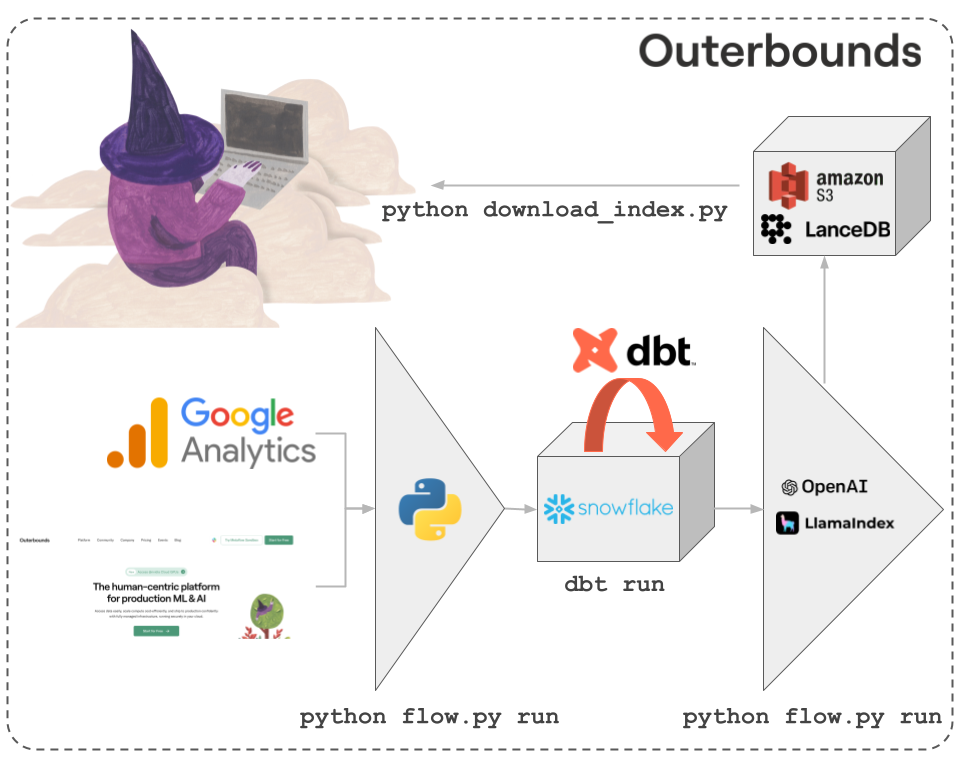

# ELT to RAG with Metaflow, dbt, and Snowflake
<a href="https://outerbounds.com/blog/reproducible-scalable-computational-biology-systems">

</a>

## How to use this repository

## Workflows and notebooks
Metaflow workflows and their code dependencies are in the [`flows`](./flows/) directory. 
The [`utils`](./flows/utils/) contained therein have corresponding notebooks used for iterative development and EDA in [`notebooks`](./notebooks/).

### Docker
The [`TransformAndIndex` workflow](./flows/transform_and_refresh_index.py) depends on a docker image. There is one in a public image reprository already configured, or you can rebuild the image yourself using [this Dockerfile](./dependencies/Dockerfile.embedding).

## One-time setup
🚨 Do not do this in the production Snowflake account unless you want to tear down and re-create the entire content universe!

### Warehouse
Snowflake setup queries are in [this directory](./snowflake_ops/).

### dbt setup

#### dbt init

🚨 Do not do this unless you want to re-create the dbt project from scratch! 
The contents of `ob_content_universe` will otherwise already be populated.

Run this command to create the `ob_content_universe` directory for dbt:
```
dbt init
```
Answering the questions will lead to dbt append an entry to a `profiles.yml` file like:
```
ob_content_universe:
  outputs:
    dev:
      account: ...
      database: ob_content_universe_db
      password: ...
      role: ob_content_universe_dbt_role
      schema: ...
      threads: 8
      type: snowflake
      user: ...
      warehouse: ...
  target: dev
```

#### Install dbt packages
Check 
```
dbt deps
```